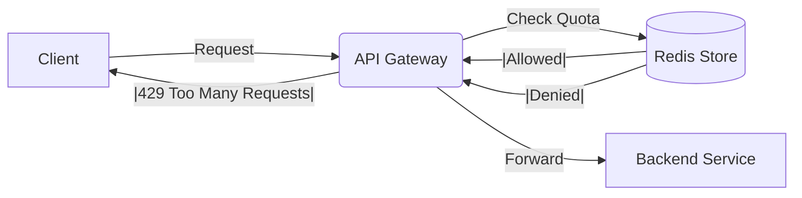
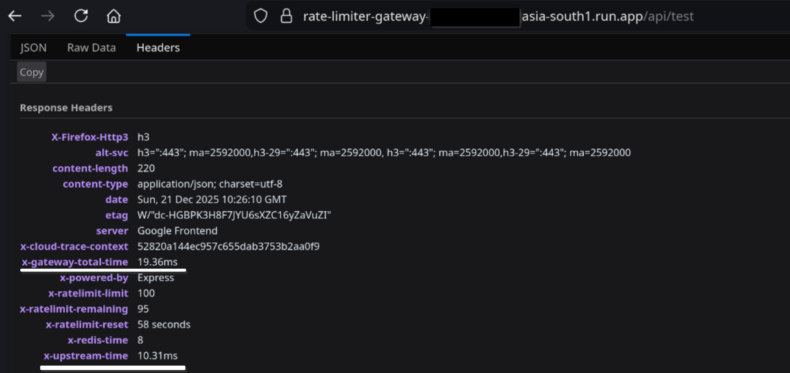

# API Gateway Limiter

#### An API Gateway implemented in Node.js using Redis and Express with the following rate limiting algorithms: Token bucket, Leaky bucket, Sliding window and Fixed window.



## Key features of this Gateway
1. Forwards valid requests to upstream services.
2. Limits incoming request to not overwhelm the server
3. Uses Redis to maintain state across multiple gateway instances.
4. Implements `x-gateway-secret` handshake to ensure backends only accept traffic from this gateway.


## Performance Metrics
Deployed on Google Cloud Run (asia-south1) with a Redis Cloud instance in the same region.   
Achieved sub-20ms internal latency by implementing the following optimizations:
- TCP Connection Pooling: Utilized `agentkeepalive` to reuse upstream connections, eliminating SSL handshake overhead.
- Region Colocation: Minimized network latency by strictly deploying compute and state in the same availability zone.

Latency Breakdown (Production Logs):
* **Redis Token Bucket Logic:** ~8ms
* **Upstream Service Response:** ~10ms
* **Total Gateway Overhead:** < 20ms



## How to run locally
### Prerequisites:
- Node.js 
- Redis instance (local or cloud)
### Approach 1: Manual Setup
1. Clone and Install
   ```
   git clone https://github.com/Shobhan-Patra/api-gateway-limiter.git
   cd api-gateway-limiter
   pnpm install // Can also use npm install
   ```
2. Configure `.env` file:
    ```
    PORT=8000

    REDIS_URL=redis://[REDIS USERNAME]:[REDIS PASSWORD]@[REDIS HOST]:[REDIS PORT]

   UPSTREAM_URL=[The server url this gateway will forward request to]
   
    GATEWAY_SECRET=[A strong secret to verify gateway-server connection]
    ```
3. Start the gateway and dummy backend
   You need two terminals
   #### Terminal 1: `pnpm run backend` starts the dummy backend server
   #### Terminal 2: `pnpm run start` starts the gateway

### Approach 2: Using Docker
1. Run `docker compose up --build`  
This starts both the gateway and a mock backend server ([traefik/whoami](https://hub.docker.com/r/traefik/whoami) docker image).
    
## How to test
Send requests to the Gateway (Port 8000). It will forward them to the Backend (Port 5000) automatically.
 ```
curl -i http://localhost:8000/api/test 
# Output: 200 OK | "Hello from Backend!"
```
Spamming this request for multiple times (max limit is determined in config/constants.js) will result in `429 Too many requests` response


## Configuration
The rate limit parameters for each algorithm can be configured in `config/constants.js`.\
You can adjust parameters such as:
- Window Size (for fixed and sliding window)
- Max Requests (per time period)
- Bucket Size and Token generation/leak rate (for token bucket and leaky bucket)

## Tech Stack
- **Runtime**: Node.js (Express)
- **State store**: Redis
- **Proxy**: http-proxy-middleware
- **Optimization**: agenkeepalive
- **Deployment**: Docker, GCP
- No external library is used to implement rate limiting algorithms

## The algorithms
1. Fixed Window:  
    Fixed window rate limiting algorithm works by dividing time into equal sized partitions or windows.
    Each window will have a fixed max number of allowed tokens in it.
    If the number of incoming requests exceed the maximum allowed requests then it blocks/discards the surplus requests.\
    The major drawback of fixed window algorithm is it can't stop bursts of request at the edge of the window\
    Suppose window start = 0 and window end = 10 and the next window starts from 10 and maxAllowedRequests = 5\
    Now when 5 requests come at time = 9 and 5 more requests come at the time = 11, these requests are allowed in their windows but actually there were 10 requests in the span of 3 seconds which is not a good thing for the backend as it allows requests burst at edges of the window to pass.

2. Sliding Window:  
   Sliding window rate limiting algorithm improves upon the fixed window approach by considering a moving time window instead of fixed partitions.  
   It keeps track of request timestamps and counts how many requests occurred in the last N seconds.  
   If the number of requests in the sliding window exceeds the maximum allowed limit, further requests are blocked or discarded.
   The major advantage of sliding window algorithm is that it prevents request bursts at the edges of windows.  
   Suppose window size = 10 seconds and maxAllowedRequests = 5.  
   If 5 requests come at time = 9 and another request comes at time = 11, the algorithm will still count the earlier requests because they fall within the last 10 seconds.  
   This ensures that no more than 5 requests are allowed in any continuous 10-second period, providing smoother and fairer rate limiting.

3. Token Bucket:  
    Token bucket rate limiting algorithm works by generating tokens at a fixed rate and storing them in a bucket with a maximum capacity.  
    Each incoming request consumes one token from the bucket.  
    If tokens are available, the request is allowed; if the bucket is empty, the request is blocked or discarded.
    The key benefit of token bucket algorithm is that it allows short bursts of traffic while still enforcing an average rate limit.  
    Suppose tokens are added at a rate of 1 token per second and bucket capacity is 5.  
    If the system has been idle, the bucket may be full and allow up to 5 requests at once.  
    After that, new requests are allowed only as new tokens are generated, protecting the backend from sustained high traffic.

4. Leaky Bucket:  
    Leaky bucket rate limiting algorithm processes requests at a fixed, constant rate, similar to water leaking from a bucket at a steady speed.  
    Incoming requests are added to a queue (the bucket), and requests are processed one by one at a predefined rate.  
    If the bucket is full, additional incoming requests are discarded.
    The main advantage of leaky bucket algorithm is that it smooths out traffic and ensures a constant request processing rate.  
    Suppose the leak rate is 1 request per second and the bucket capacity is 5.  
    If 10 requests arrive at once, only 5 are queued and processed gradually, while the remaining requests are dropped.  
    This prevents sudden bursts and ensures stable load on the backend.

## LICENCE
This project is licensed under the MIT License - see the [LICENSE](https://github.com/Shobhan-Patra/api-gateway-limiter/blob/main/LICENSE)
file for details.